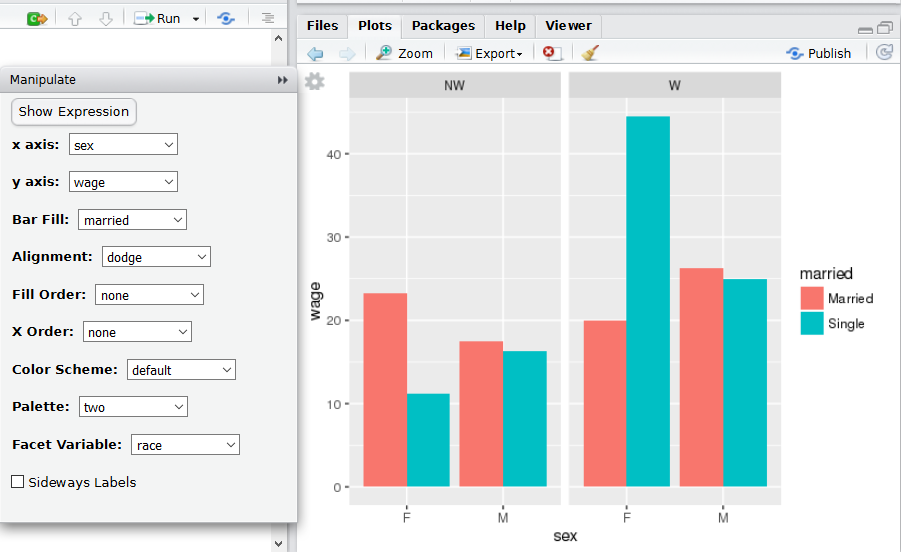

# Week 3 Project

## Eloa

<!-- leave this material as is -->
Compiled on `r date()`.

```{r include = FALSE}
library(DataComputing)
```
<!-- put your content after this line -->

Here is my content!
Problem 5.1

Using barGraphHelper(CPS85)




Problem #5.2 - this does not seem to be working well. I don't know why.
```{r}
WorldMap(data = HappinessIndex, key ="country", fill = "corruption")
```

Problem 6.5
b) State and polling organizations

Problem 6.6
d) Glyph: rectangle. Graphcial attribute: color and text

Problem 6.7
d)NYT probability for the Democrativ candidate.

Problem 6.8
Frame: based on bmi and weight.
glyphs: circle. 
graphical attribute: color (smoker/non-smoker), location (in relation to bmi and weight).


Problem 7.1
a) sumarise()
b) mutate()
c)
d) filter()
e)
f) group_by

Problem 7.4

a)BabyNames -> grup_by("First") %>%
    summarises(voteReceived=n())
    
b)Tmp <- group_by(BabyNames, year, sex) %>%
    summarises(totalBirths=sum(count))
    
c)Tmp <- group_by(BabyNames, year, sex) %>%
    summarises(BabyNames, totalBirths=sum(count))
    
    
Problem 7.5
a)  
b)filter(sex=="f")

c)filter(sex=="m")

d)summarizes(total = sum(count))

e)select(name,count)

 
 
Problem 7.11

a) sex, count, meanAge

b) diagnoses, count, meanAge

c) age, diagnoses, count, meanAge

d) age, count, meanAge

c) sex, diagnoses,  count, meanAge